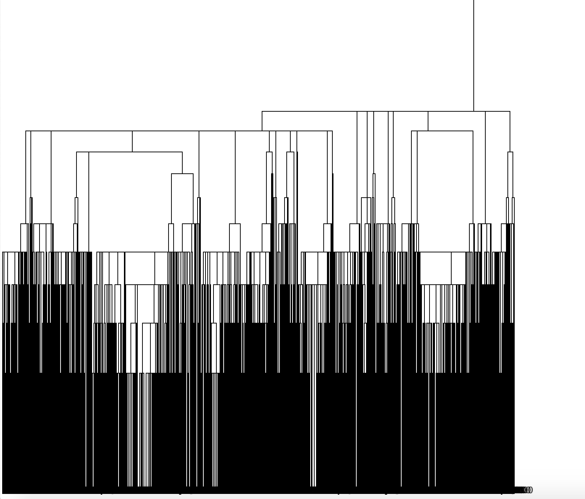

# Absenteeism_at_work_AAA

# Project Defination: 
                                  In this absenteeism data set out main goal is to discover new knowledge using hierarchical clustering. This is an Unsupervised machine learning technique is to find similarities in the data point and group similar data points together. For this project target attribute is Absenteeism time in hours. There are 21 attribute and 740 instances in this DataSet. I Consider all attribute as a input to gather knowledge.

# Literature Survey: 
                                        The high competitiveness in the market, professional development combined with the development of organizations and the pressure to reach increasingly audacious goals, create increasingly overburdened employees and end up acquiring some disturbance in the state of health related to the type of work activity, including depression considered the evil of the 21st century. Taking employees to absenteeism. Absenteeism is defined as absence to work as expected, represents for the company the loss of productivity and quality of work. The main purpose of that paper was to apply an artificial neural network to prediction of absenteeism at work. ANN they are models consisting of simple processing units, called artificial neurons, these models are inspired by the structure of the brain and aim to simulate human behavior, such as learning, association, generalization and abstraction when submitted to training. The experiments with the ANN presented the expected results in prediction of absenteeism at work. Therefore, it is concluded that the ANN can be applied in the prediction of absenteeism at work.(1)
                                 
Methods:    
                  For this  absenteeism at work data set we used hierarchical clustering .For this clustering used two methods---
            1.  single-link method
             2. Agglomerative method
  Euclidean distance formula is used to measure distance.

Clustered Instances
   
   

| Clustered     | Instances           
| ------------- |:-------------
     0            710 ( 96%)
     1            7 (  1%)
     2            6 (  1%)
     3            2 (  0%)
     4            7 (  1%)
     5            4 (  1%)
     6            2 (  0%)
     7            1 (  0%)
     8            1 (  0%)

# Discover knowledge From absenteeism At Work Data Set:
                                                                                                        Using hierarchical cluster the total data set(instances) are devided into 9 clusters through the cutting point of the 
dendogram.  So we can gather knowledge from  these different clusters.
Clusters(7,8)  has only 1 instances  and cluster 6 has two instances so we can not gather more knowledge from these clusters. So we will ignore this three cluster.

# According to absenteeism in hours(targeted):

In **Cluster0** the average absenteeism time in hours is 7.038 is maximum among other cluster .For this absenteeism the main reason is medical consultation and dental consultation.This absenteeism in maximum happen in February, March and October month . If we see the average  workload  for this cluster is maximum except cluster3.so we also can say that workload can be another reason for absenteeism. In season spring and Autumn the absenteeism happened the most.

In **Cluster5** the average absenteeism time in hours is 5.25 .For this absenteeism the main reason is Diseases of the ear and mastoid process.This absenteeism in maximum happen in May month which is in winter season.

In **Cluster4** the average absenteeism time in hours is 4.86 .For this absenteeism the main reason is Diseases of the ear and mastoid process.This absenteeism in maximum happen in june month which is in summer season. 

In **Cluster1** the average absenteeism time in hours in 4.4286.For this absenteeism the main reason is Diseases of the blood and blood-forming organs and certain disorders involving the immune mechanism.This absenteeism in maximum happen in August month which is in summer and autumn season. 

In **Cluster2** the average absenteeism time in hours in 4.166. For this absenteeism the main reason is is Diseases of the ear and mastoid process. This absenteeism in maximum happen in August month. 

 **Cluster3**: This is the exceptional cluster , average absenteeism time in hours is  0.0 .This is the only cluster where no absenteeism happened. All the member in this cluster was regular. 
 

# Summary:
               The main reason for absenteeism is medical consultation and dental consultation. The employee were mostly absent on march and October month. After dividing  all the instances into 9 cluster we got 1 exception cluster where all employee were present everyday , no matter what’s the distance and workload is all the employee was present everyday.
                                              

## Reference:

1. Martiniano, A., Ferreira, R. P., Sassi, R. J., & Affonso, C. (2012). Application of a neuro fuzzy network in prediction of absenteeism at work. In Information Systems and Technologies (CISTI), 7th Iberian Conference on (pp. 1-4). IEEE.

